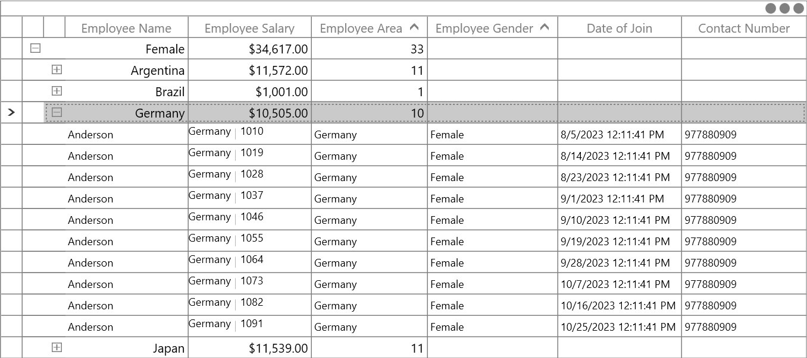
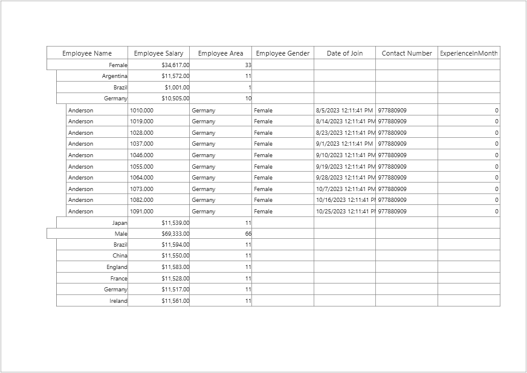

# How to Print Display Value of GridTemplateColumn in WPF DataGrid?

This sample show cases how to print DisplayValue of [GridTemplateColumn](https://help.syncfusion.com/cr/wpf/Syncfusion.UI.Xaml.Grid.GridTemplateColumn.html) in [WPF DataGrid](https://www.syncfusion.com/wpf-ui-controls/datagrid) (SfDataGrid).

You can print a displayed data except `GridTemplateColumn` [CellTemplate](https://help.syncfusion.com/cr/wpf/Syncfusion.UI.Xaml.Grid.GridColumnBase.html#Syncfusion_UI_Xaml_Grid_GridColumnBase_CellTemplate) and changed it format by overriding the [GetColumnElement](https://help.syncfusion.com/cr/wpf/Syncfusion.UI.Xaml.Grid.GridPrintManager.html#Syncfusion_UI_Xaml_Grid_GridPrintManager_GetColumnElement_System_Object_System_String_) in [GridPrintManager](https://help.syncfusion.com/cr/wpf/Syncfusion.UI.Xaml.Grid.GridPrintManager.html) class in `DataGrid`.

```c#
protected override object GetColumnElement(object record, string mappingName)
{
    var column = dataGrid.Columns[mappingName];
    if (column.CellTemplate == null)
        return base.GetColumnElement(record, mappingName);
    else
    {
        var tb = new TextBlock
        {
            VerticalAlignment = VerticalAlignment.Center,
            TextAlignment = GetColumnTextAlignment(mappingName),
            TextWrapping = GetColumnTextWrapping(mappingName),
            FlowDirection = PrintFlowDirection,
            DataContext = record
        };
        tb.SetBinding(TextBlock.TextProperty, column.DisplayBinding);
        decimal value;
        decimal.TryParse(tb.Text, out value);
        tb.Text = value.ToString("F3");
        var padding = column.ReadLocalValue(GridColumn.PaddingProperty);
        tb.Padding = padding != DependencyProperty.UnsetValue
                            ? column.Padding
                            : new Thickness(4, 3, 3, 1);
        return tb;
    }
}
```





## Requirements to run the demo
 Visual Studio 2015 and above versions